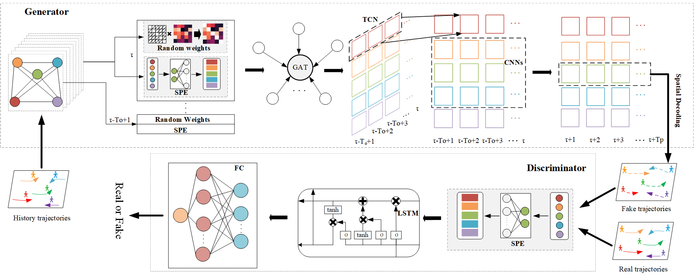

# Pedestrian Trajectory Prediction Based on Social Interactions Learning with Random Weights

### Social-dggan

</img>

 

### Requirements
- torch == 1.10.2
- visdom == 0.1.8.9

<!-- ### ADE/FDE metrics

|  | eth | hotel | univ| zara1 | zara2| avg| 
| ------------- | ------ | ------ | ------ | ------ | ------ | ------ |
| ours | 0.66/1.23 | **0.35**/**0.54** | 0.51/**0.73** | 0.35/0.58 | 0.32/0.54  | **0.438**/**0.72** |
| social-stgcnn | 0.64/1.11 | 0.49/0.85 | 0.44/0.79 | 0.34/0.53 | 0.30/0.48 | 0.442/0.75 | -->